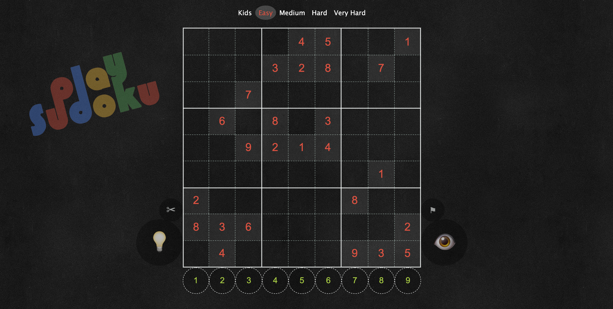

# Play Sudoku

A Javascript(React) Sudoku game for playing on web browsers.

## Build and Run

> npm install
> npm start

## Gameplay

<h3> Playing </h3>

* Click on a cell.
* Then, click on a number displayed below game board.
* If you need any help, use the buttons described below.

<h3> Buttons </h3>

* <b>Lightbulb:</b> Gives a clue about which numbers can be in the selected cell.
* <b>Scissors:</b> Clear a cell that user entered a number before.
* <b>Flag:</b> Surrender button, solves the puzzle for you.
* <b>Eye:</b> Joker button, puts the expected number for the selected cell, you have only <b> 3 </b> jokers!